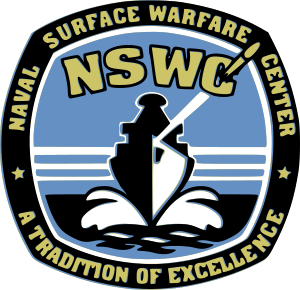

============

### NSWC Mathematical Library

The NSWC Mathematics Subroutine Library is a collection of Fortran
77 routines specializing in numerical mathematics collected and
developed by the U.S. Naval Surface Warfare Center.

This software is made available, without cost, to the general
scientific community. The 1993 edition is an update of the 1990 edition.
NSWC has made every effort to include only reliable, transportable, reasonably
efficient and easy to use code in this library. They have thoroughly tested
all the routines on a variety of machines ranging from supercomputers to PC's.
